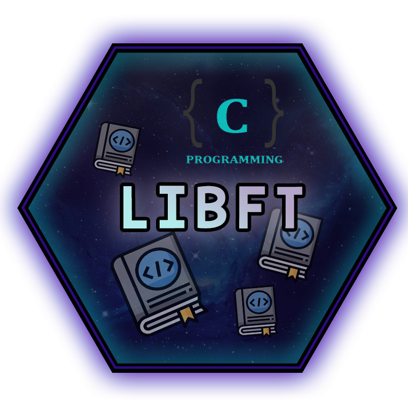
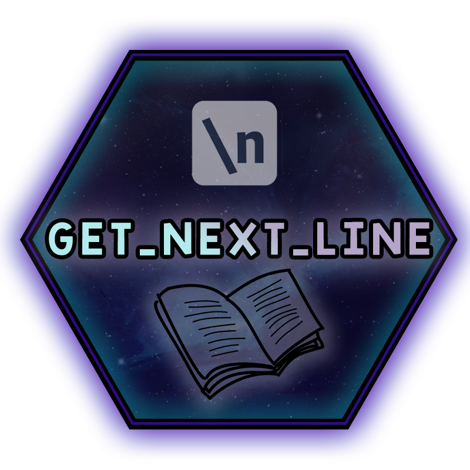
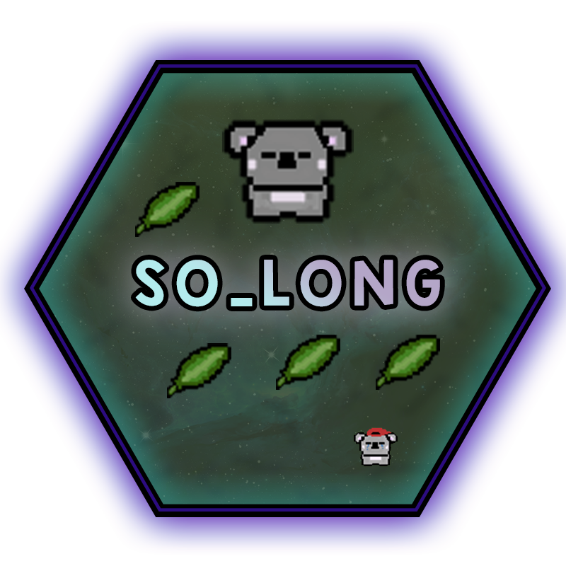
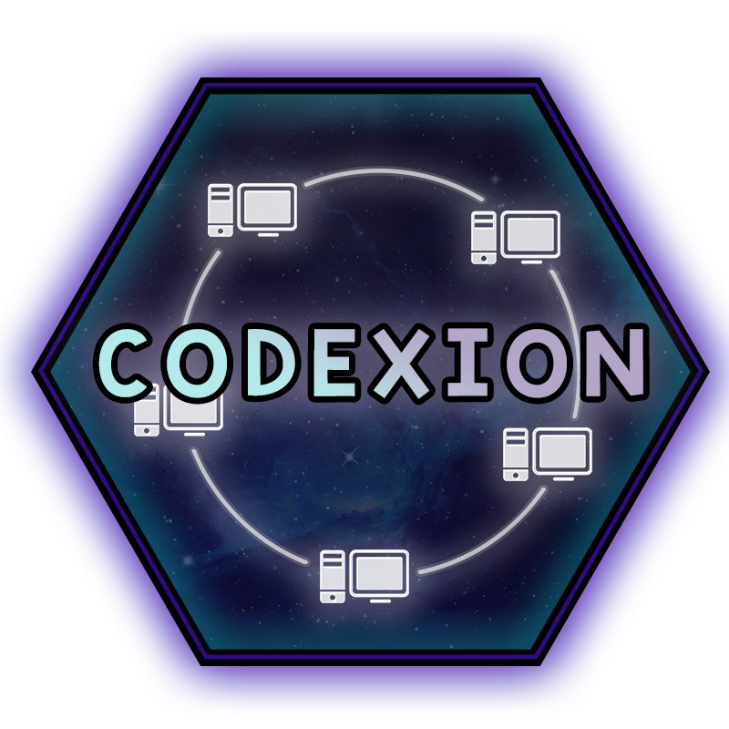
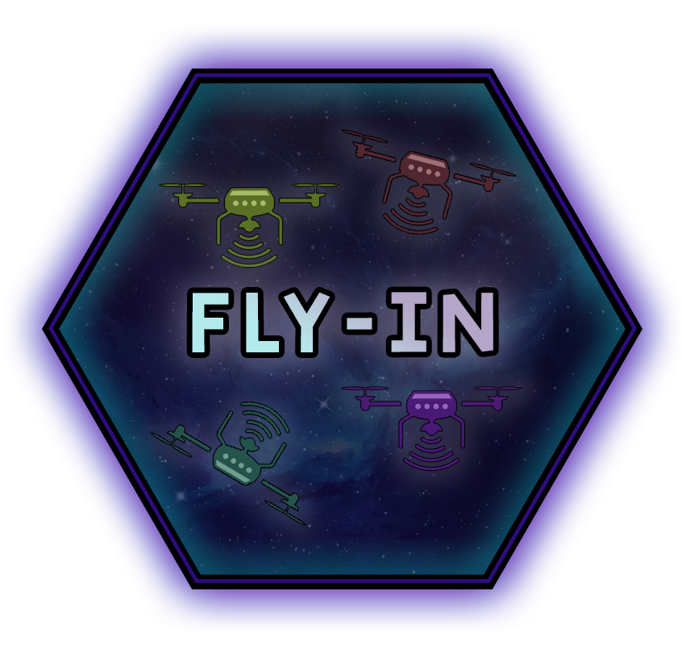
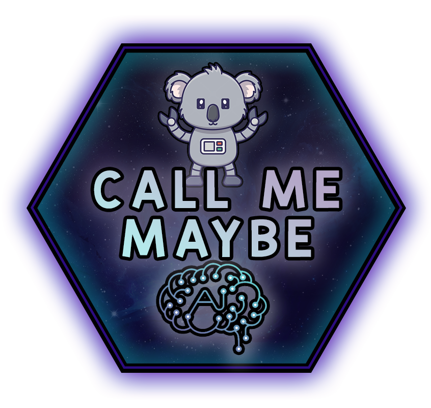

<h3 align="left">Hi, I'm Overtek. Currently student at 42 Le Havre.</h3>
 
<h2 align="left">My 42 projects.</h2>

  
  &nbsp;
  
  &nbsp;
  
  &nbsp;
  
  &nbsp;
  
  &nbsp;
  
  &nbsp;
  
  &nbsp;
  
  &nbsp;
  
  &nbsp;
  
  &nbsp;
  

 

<h2 align="left">GitHub Stats</h2>

  
  

<h2 align="left">Skills</h2>

 

