###  Hello there !
&nbsp;
&nbsp;
### 👨🏻‍💻 &nbsp;About Me

💡 &nbsp; I'm a student in formation at 42 Le Havre. \
💻 &nbsp;I'm currently learning programming, developping and game developpement.\
📀 &nbsp;My favorite langage is Python.\
✍️ &nbsp;In my free time, I try to learn as much as I can about other programmation langages, developping my own programm and much more.\
🌱 &nbsp;You can see my 42 schools project just below.

  
🚀 42 Cursus Projects

   

  

    
📌 Circle 0

    <table width="100%">
      <tr>
        <th width="30%">Project</th>
        <th width="70%">Description</th>
      </tr>
      <tr>
        <td align="center">
          <a href="https://github.com/Overtekk/Libft">
            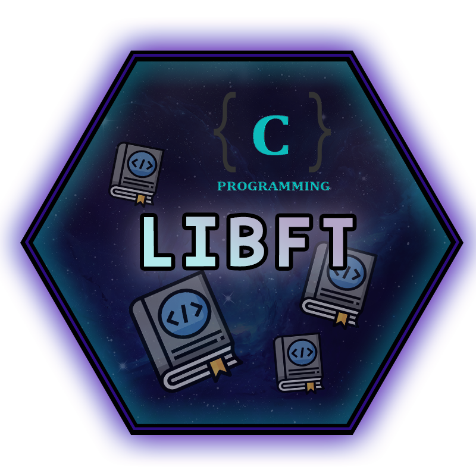
          </a>
        </td>
        <td>
          <strong>Libft (C)</strong> 
          A fundamental project involving the creation of a personal C library, recoding standard libc functions for future use in the cursus.
        </td>
      </tr>
    </table>
  

  

    
📌 Circle 1

    <table width="100%">
      <tr>
        <th width="30%">Project</th>
        <th width="70%">Description</th>
      </tr>
      <tr>
        <td align="center">
          <a href="https://github.com/Overtekk/ft_printf">
            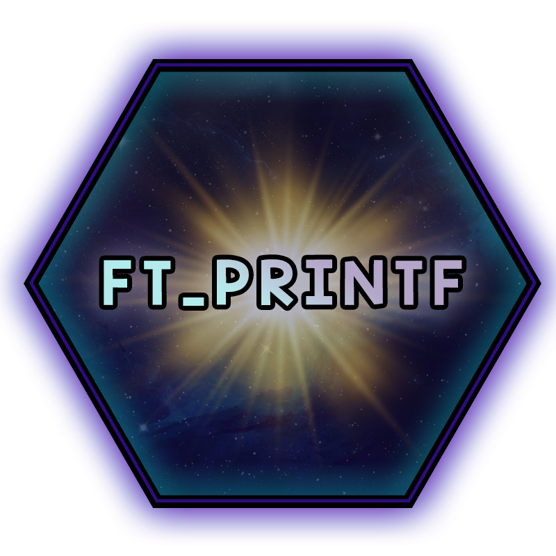
          </a>
        </td>
        <td>
          <strong>ft_printf (C)</strong> 
          An implementation of the famous printf function, learning about variadic arguments and complex string formatting.
        </td>
      </tr>
      <tr>
        <td align="center">
          <a href="https://github.com/Overtekk/get_next_line">
            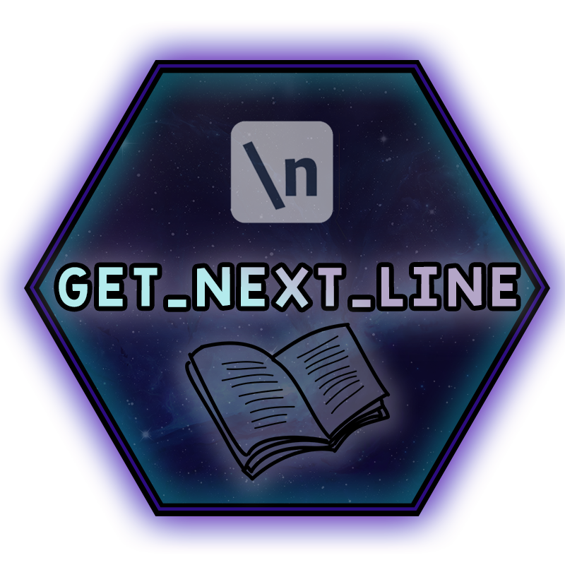
          </a>
        </td>
        <td>
          <strong>get_next_line (C)</strong> 
          Developing a function that reads a line from a file descriptor, focusing on static variables and buffer management.
        </td>
      </tr>
    </table>
  

  

    
📌 Circle 2

    <table width="100%">
      <tr>
        <th width="30%">Project</th>
        <th width="70%">Description</th>
      </tr>
      <tr>
        <td align="center">
          <a href="https://github.com/Overtekk/so_long">
            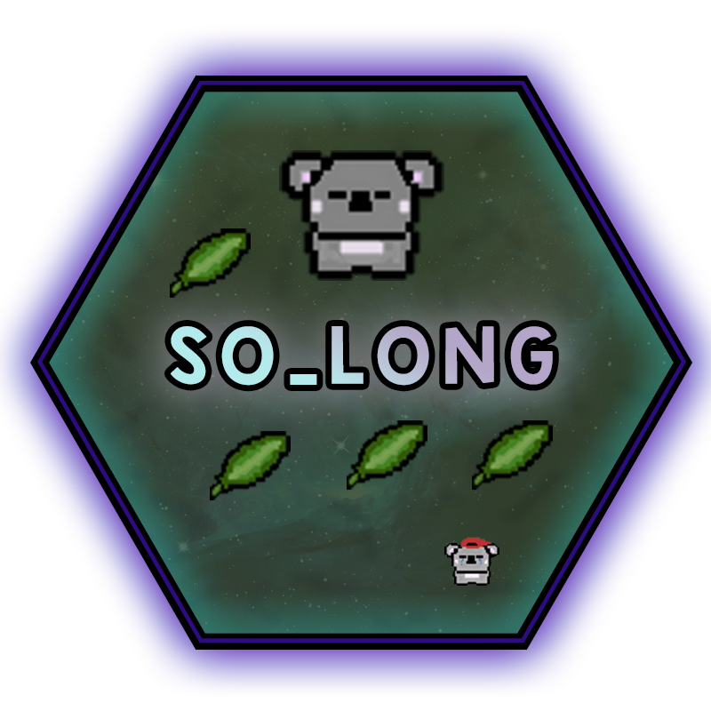
          </a>
        </td>
        <td>
          <strong>so_long (C)</strong> 
          A small 2D game built with the MiniLibX, exploring textures, sprites, and basic window event management.
        </td>
      </tr>
      <tr>
        <td align="center">
          <a href="https://github.com/Overtekk/push_swap">
            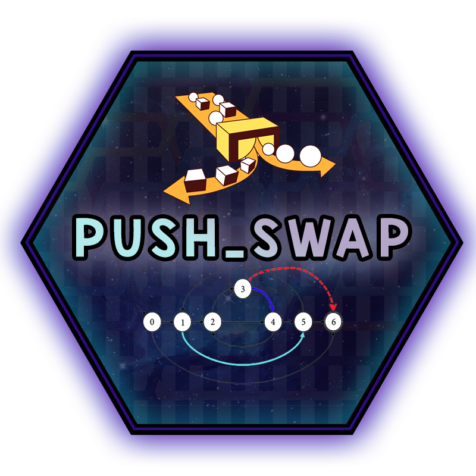
          </a>
        </td>
        <td>
          <strong>push_swap (C)</strong> 
          An algorithmic project focused on sorting data on stacks with a limited set of instructions, optimized for the lowest move count.
        </td>
      </tr>
      <tr>
        <td align="center">
          <a href="https://github.com/Overtekk/minitalk">
            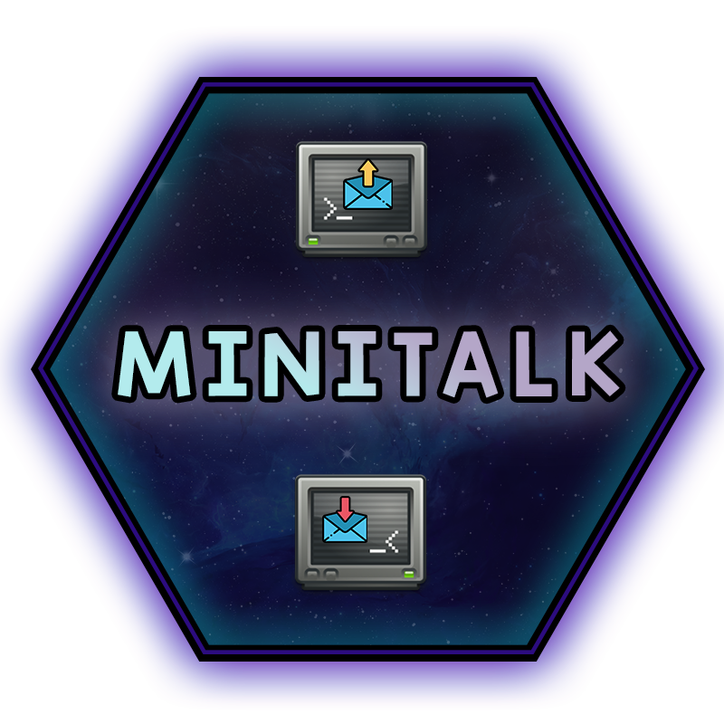
          </a>
        </td>
        <td>
          <strong>minitalk (C)</strong> 
          A client-server communication application using UNIX signals (SIGUSR1 and SIGUSR2).
        </td>
      </tr>
      <tr>
        <td align="center">
          <a href="https://github.com/Overtekk/Python-Module-00-10">
            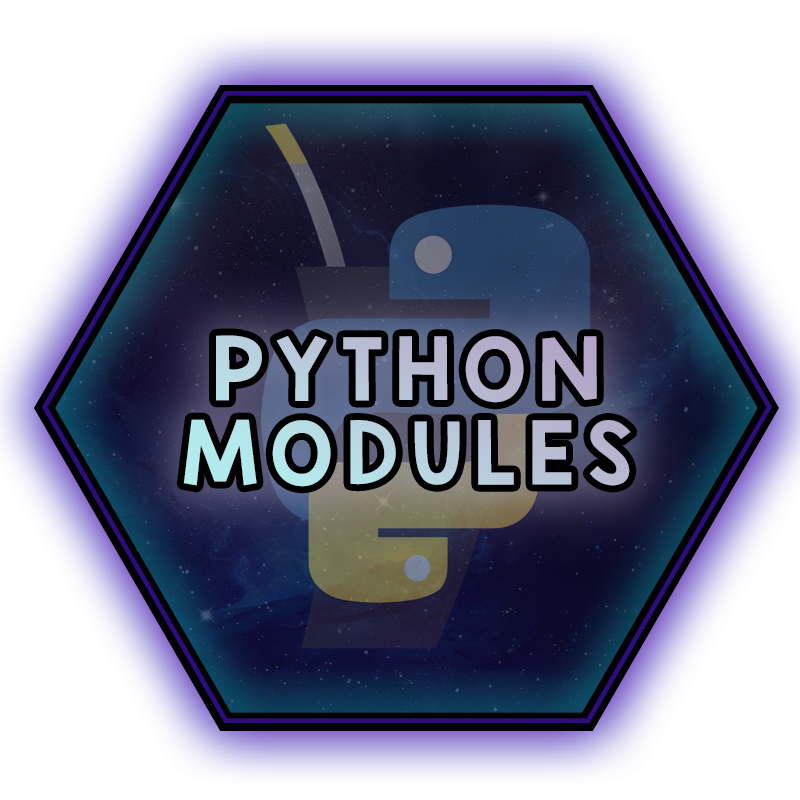
          </a>
        </td>
        <td>
          <strong>Python Modules (Python)</strong> 
          A comprehensive dive into Python, covering data structures, object-oriented programming, and data science basics.
        </td>
      </tr>
      <tr>
        <td align="center">
          <a href="https://github.com/Overtekk/A_Maze_ing">
            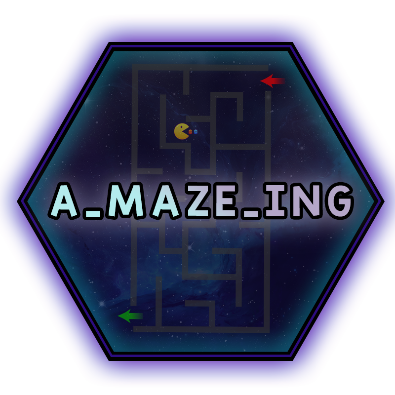
          </a>
        </td>
        <td>
          <strong>A_Maze_ing (Python)</strong> 
          Exploring maze generation algorithms and maze solver.
        </td>
      </tr>
    </table>
  

  

    
📌 Circle 3

    <table width="100%">
      <tr>
        <th width="30%">Project</th>
        <th width="70%">Description</th>
      </tr>
      <tr>
        <td align="center">
          <a href="https://github.com/Overtekk/Codexion">
            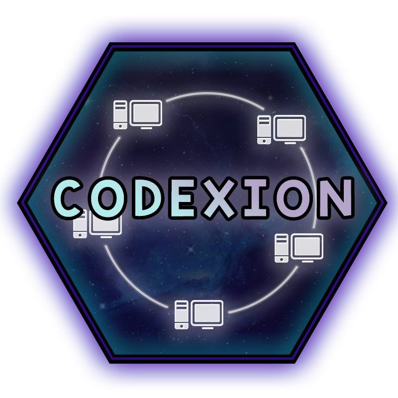
          </a>
        </td>
        <td>
          <strong>Codexion (C)</strong> 
          Discovering threads and data-race in C.
        </td>
      </tr>
      <tr>
        <td align="center">
          <a href="https://github.com/Overtekk/Fly-in">
            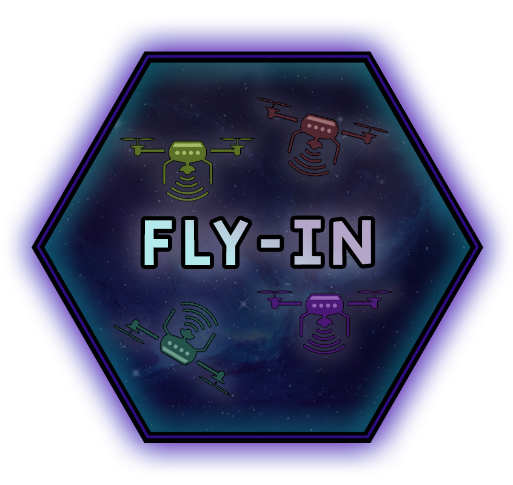
          </a>
        </td>
        <td>
          <strong>Fly-in (Python)</strong> 
          Python project about graph and algorithms to find the best way across a strict network constraints.
        </td>
      </tr>
      <tr>
        <td align="center">
          <a href="https://github.com/Overtekk/Call_Me_Maybe">
            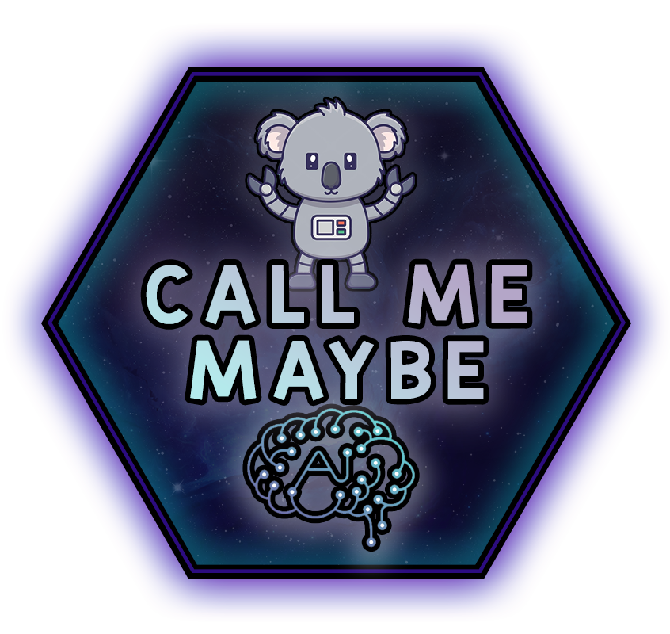
          </a>
        </td>
        <td>
          <strong>Call Me Maybe (Python)</strong> 
          Discovering the role of a LLM and generate functions calling.
        </td>
      </tr>
    </table>
  

  

    
📌 Circle 4

    <table width="100%">
      <tr>
        <th width="30%">Project</th>
        <th width="70%">Description</th>
      </tr>
      <tr>
        <td align="center">
          <a href="https://github.com/Overtekk/NetPractice">
            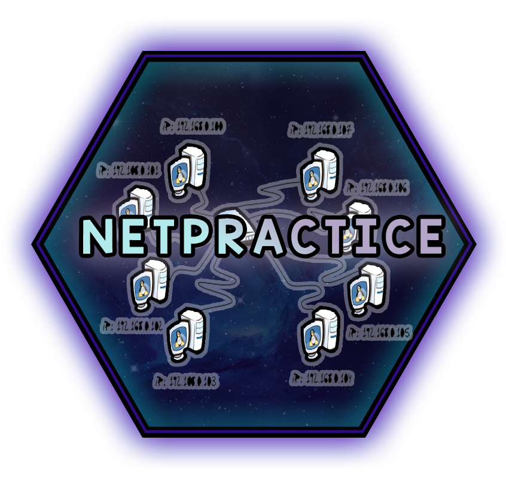
          </a>
        </td>
        <td>
          <strong>NetPractice (Python)</strong> 
          Discover the basics of networking.
        </td>
      </tr>
      <tr>
        <td align="center">
          <a href="https://github.com/Overtekk/PacMan">
            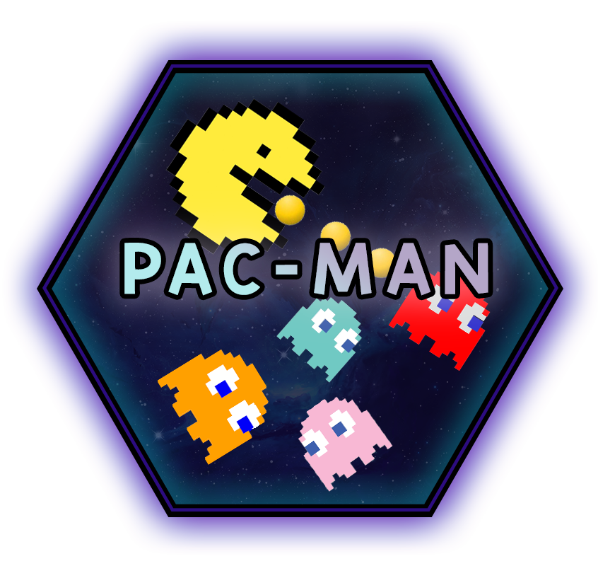
          </a>
        </td>
        <td>
          <strong>PacMan (Python)</strong> 
          Recreate the famous arcade game Pac-man!.
        </td>
      </tr>
    </table>
  

---

### 🛠 &nbsp;Tech Stack

&nbsp;
&nbsp;
&nbsp;
&nbsp;
&nbsp;
&nbsp;
&nbsp;
&nbsp;
&nbsp;

---

### 📈 &nbsp;GitHub Activity Graph:

  
  
  

